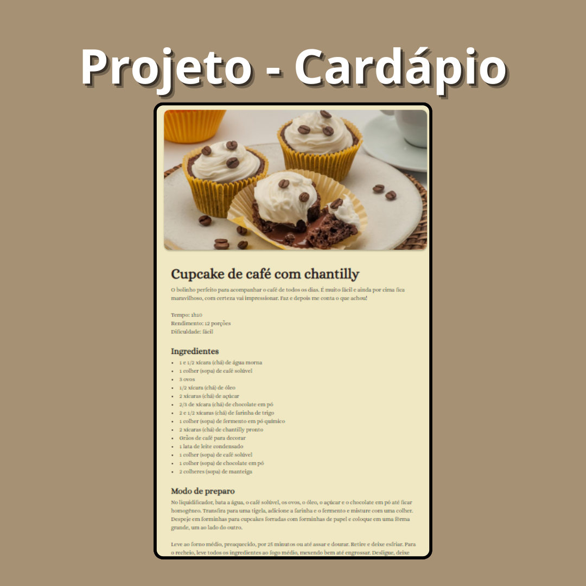

<h1 align="center">Receitas</h1>

Página de receita de cupcake com o seu modo de preparo. 
https://ldcmartins.github.io/PROJETO-CARDAPIO/

  <a href="#-tecnologias">Tecnologias</a>&nbsp;&nbsp;&nbsp;|&nbsp;&nbsp;&nbsp;
  <a href="#-projeto">Projeto</a>&nbsp;&nbsp;&nbsp;|&nbsp;&nbsp;&nbsp;
  <a href="#-layout">Layout</a>&nbsp;&nbsp;&nbsp;|&nbsp;&nbsp;&nbsp;
  <a href="#memo-licença">Licença</a>

  

 

  

## 🚀 Tecnologias

Esse projeto foi desenvolvido com as seguintes tecnologias:

- HTML e CSS
- Git e GitHub

## 🎓 Aprendizado

Aprendi nesse projeto a utilizar alguns conceitos como padding, margin e footer. 

## :memo: Licença

Esse projeto está sob a licença MIT.
